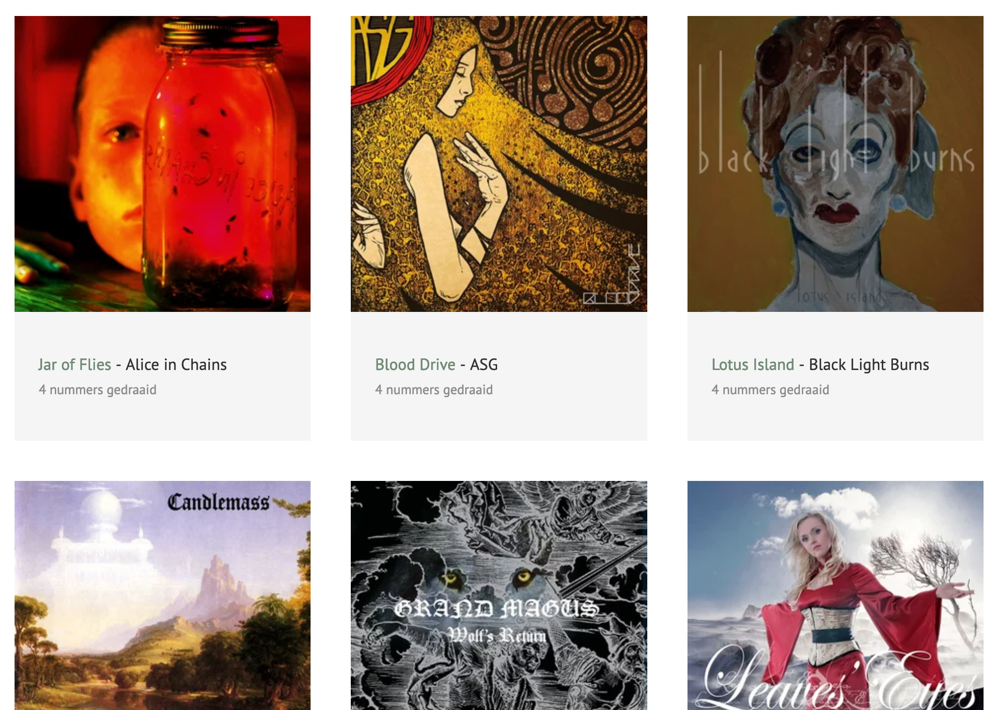
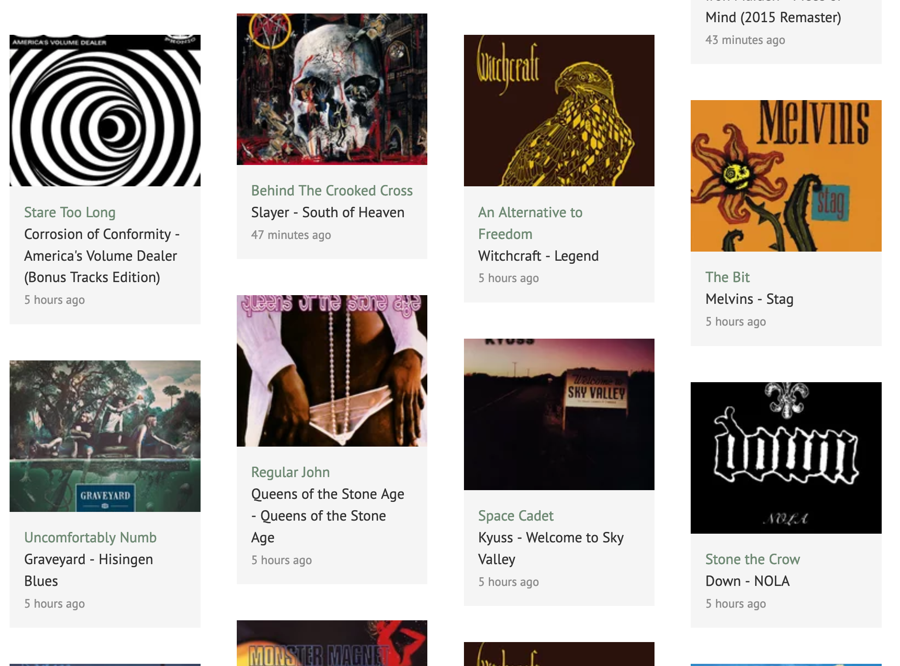
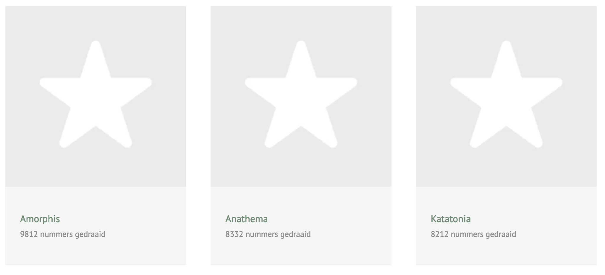

# Kirby Plugin: MyLastFM

This plugin allows you to show recent tracks and albums for a Last.fm account on your Kirby site

## Git submodule

```
git submodule add https://github.com/mirthe/kirby_mylastfm site/plugins/mylastfm
```

## Usage

Add your LastFM API key and username to your config

    'lastfm.apiKey'     => 'xxx',
    'lastfm.username'   => 'xxx',

Include one or more of the following snippets to display your recently played albums, tracks or favorite artists on a page

    <?php snippet('lastfm-albums-played'); ?>
    <?php snippet('lastfm-recenttracks'); ?>
    <?php snippet('lastfm-topartists'); ?>

Recently added a compact listing for my Now page, with an optional limit

    <?php snippet('lastfm-recenttracks-short', ['limit' => 3 ]) ?>

## Example 

### Albums played
<p></p>

### Recent tracks
<p></p>

### Top artists
<p></p>

## Todo

- Add band photo to artist view, LastFM currently doesn't offer one
- Add translations for labels
- Offer as an official Kirby plugin
- Add sample SCSS to this readme
- Cleanup code
- Lots..
